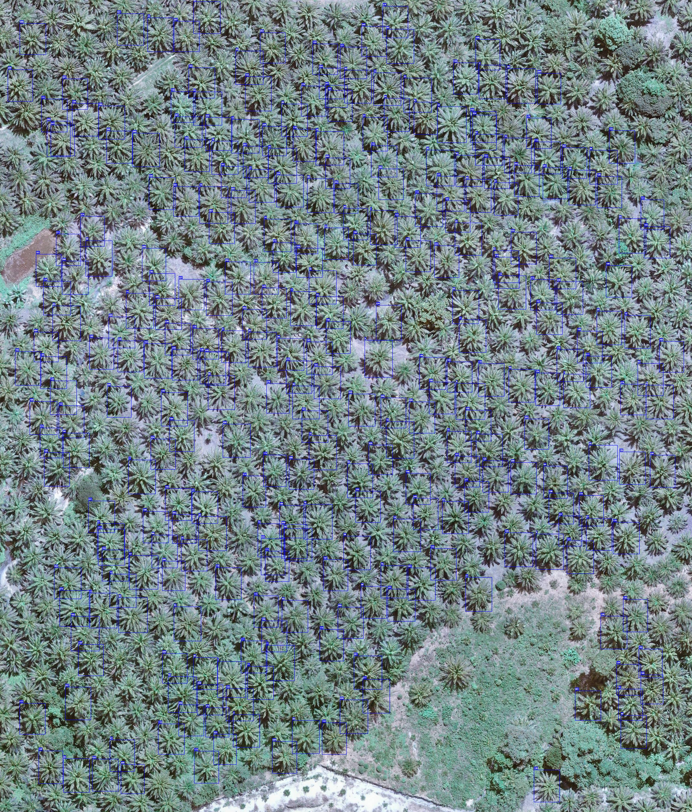
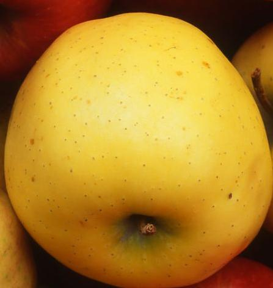
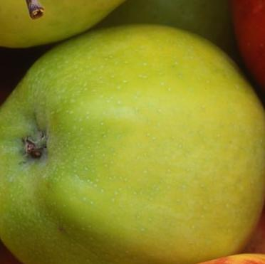

# Image Detection and Classification with YOLOv11

## Description
This project consists of two programs:
1. **Count**: This program detects oil palm trees using the YOLOv11 model and displays sequential bounding boxes for each detected palm tree. The output image will show the detected palm trees labeled with sequential numbers.
2. **Classify**: This program crops apple images based on color classification: red, yellow, and green. Each cropped apple image will be saved as a separate file labeled according to its color.

## Features
- **Count Program**:
  - Detects oil palm trees.
  - Displays sequentially labeled bounding boxes for each detected palm tree.
  - Outputs a new image with labeled bounding boxes.

- **Classify Program**:
  - Detects and classifies apples based on their color (red, yellow, green).
  - Crops apple images and saves them as separate files based on their color classification.
  - Outputs cropped images named red_1.jpg, yellow_1.jpg, green_1.jpg, etc.

## Requirements
- Python 3.11.x
- YOLOv11 (for object detection)
- OpenCV (for image manipulation)
- Roboflow for training datasets

## Installation

1. **Clone Repository**:
   ```bash
   git clone https://github.com/tribber93/Test_Gambar.git
   cd repository
    ```

2. **Install Dependencies**: You need to install the required dependencies. Run the following command:

    ```bash
    pip install -r requirements.txt
    ```

## Dataset
The datasets for both programs are downloaded and trained from Roboflow.

- [Palm Tree Dataset](https://universe.roboflow.com/aakash-thapa-5qpod/palm-tree-label-200m-splitted-wdpy4) : A dataset containing images of palm trees in plantations.
- [Apple Dataset](https://universe.roboflow.com/nn-2ju5u/apple_maturity-1ayzw) : A dataset containing images of apples in various colors (red, yellow, green).

## Training
To train the YOLOv11 model, Jupyter notebooks have been provided in this repository. You can find them in [Count Palm Tree](./Count.ipynb) and [Classify Apple](./Classify.ipynb).

## Penggunaan
- **Count Program**:

You can use it via the terminal by running the following command:

```bash
yolo task=detect mode=predict model=model/palm/best.pt conf=0.25 source='https://storage.googleapis.com/648010c1-f244-4641-98f2-73ff6c1b4e99/ai_assignment_20241202_count.jpeg'
```
Or by running the following script:
### Import libraries
```python
import os
import cv2
import requests
import numpy as np
from PIL import Image
from ultralytics import YOLO

import matplotlib.pyplot as plt
import matplotlib.patches as patches
```

### Load model
```python
model = YOLO('model/palm/best.pt')
image = Image.open(requests.get('https://storage.googleapis.com/648010c1-f244-4641-98f2-73ff6c1b4e99/ai_assignment_20241202_count.jpeg', stream=True).raw)
result = model.predict(image, conf=0.25)[0]
```

### Display Detection Results
```python
from typing_extensions import Annotated

# Konversi gambar ke format OpenCV
image_cv = np.array(image)
if image_cv.shape[2] == 4: 
    image_cv = cv2.cvtColor(image_cv, cv2.COLOR_RGBA2RGB)

# Tambahkan anotasi ke gambar
for idx, box in enumerate(result.boxes.xyxy):
    x1, y1, x2, y2 = map(int, box)
    label = str(idx + 1)

    # Gambar kotak berwarna biru
    cv2.rectangle(image_cv, (x1, y1), (x2, y2), (255, 0, 0), 2)

    # Tambahkan label di atas kotak
    text_size = cv2.getTextSize(label, cv2.FONT_HERSHEY_SIMPLEX, 0.5, 2)[0]
    text_x, text_y = x1, y1 - 10
    text_x = max(text_x, 0)
    text_y = max(text_y, 10)

    cv2.rectangle(image_cv, (text_x, text_y - text_size[1] - 5), (text_x + text_size[0], text_y + 5), (255, 0, 0), -1)
    cv2.putText(image_cv, label, (text_x, text_y), cv2.FONT_HERSHEY_SIMPLEX, 0.5, (255, 255, 255), 2)

# Tampilkan atau simpan hasil gambar
annotated_image = Image.fromarray(cv2.cvtColor(image_cv, cv2.COLOR_BGR2RGB))
# Untuk menyimpan gambar
resized_image = annotated_image.resize((annotated_image.width // 2, annotated_image.height // 2))  
resized_image.save('Count_Palm.jpg', optimize=True, quality=70) 
resized_image
```

The output will be an image with sequentially numbered bounding boxes for detected palm trees, as shown below.


- **Classify Program**:

You can use it via the terminal by running the following command:

```bash
yolo task=detect mode=predict model=model/apple/best.pt conf=0.4 source='https://storage.googleapis.com/648010c1-f244-4641-98f2-73ff6c1b4e99/ai_assignment_20230726_classify.jpeg
```

Or by running the following script:
- Import libraries as done  [above](#import-library)

```python
# Load model
model = YOLO('model/apple/best.pt')

image = Image.open(requests.get('https://storage.googleapis.com/648010c1-f244-4641-98f2-73ff6c1b4e99/ai_assignment_20230726_classify.jpeg', stream=True).raw)
result = model.predict(image, conf=0.4)[0]
```
To generate output images named red_1.jpg, yellow_1.jpg, green_1.jpg, etc., you can use the following script:
```python
# Get bounding boxes and class labels
boxes = result.boxes.xyxy  
class_ids = result.boxes.cls  
labels = result.names  

# Create directory to save cropped images
output_dir = '/cropped_apple'
os.makedirs(output_dir, exist_ok=True)

# Dictionary to store class indices
class_indices = {}

# Crop and save each detected object
for i, (box, class_id) in enumerate(zip(boxes, class_ids)):
    # Get bounding box coordinates
    xmin, ymin, xmax, ymax = map(int, box)

    # Get the class label (red, green, yellow)
    class_label = labels[int(class_id)]

    # If the class is not seen before, initialize its index
    if class_label not in class_indices:
        class_indices[class_label] = 1
    class_idx = class_indices[class_label]

    # Crop the image
    cropped_image = image.crop((xmin, ymin, xmax, ymax))

    cropped_image.save(os.path.join(output_dir, f"{class_label}_{class_idx}.jpg"))
    class_indices[class_label] += 1

print(f"Images saved in {output_dir}")
```
The output will appear as shown in the "cropped_apple" folder:
<div style="display: flex; justify-content: space-between; align-items: center;">
  <div style="text-align: center;">
    
    <p>Red Apple</p>
  </div>
  <div style="text-align: center;">
    
    <p>Yellow Apple</p>
  </div>
  <div style="text-align: center;">
    
    <p>Green Apple</p>
  </div>
</div>