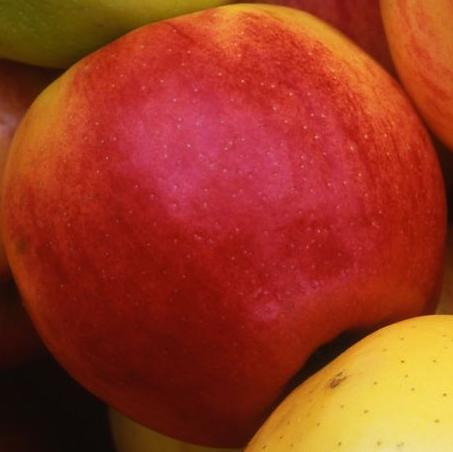

# Image Detection and Classification with YOLOv5

## Deskripsi
Proyek ini terdiri dari dua program:
1. **Count**: Program ini akan mendeteksi pohon sawit menggunakan model YOLOv11 dan menampilkan kotak pembatas (bounding box) berurutan untuk setiap pohon sawit yang terdeteksi. Gambar hasil keluaran akan menunjukkan pohon sawit yang terdeteksi dengan nomor urut.
2. **Classify**: Program ini akan memotong gambar apel berdasarkan klasifikasi warna: merah, kuning, dan hijau. Setiap apel yang dipotong akan disimpan dalam file terpisah yang diberi label sesuai dengan warna apel tersebut.

## Fitur
- **Count Program**:
  - Deteksi pohon sawit.
  - Menampilkan kotak pembatas yang berurutan dengan nomor untuk setiap pohon sawit.
  - Output berupa gambar baru dengan bounding boxes berlabel.

- **Classify Program**:
  - Deteksi dan klasifikasi apel berdasarkan warna (merah, kuning, hijau).
  - Memotong gambar apel dan menyimpannya dalam file terpisah berdasarkan klasifikasi warna.
  - Output berupa gambar cropped dengan nama file `red_1.jpg`, `yellow_1.jpg`, `green_1.jpg`, dll.

## Persyaratan
- Python 3.11.x
- YOLOv11 (untuk deteksi objek)
- OpenCV (untuk manipulasi gambar)
- Roboflow untuk dataset pelatihan

## Instalasi

1. **Clone Repository**:
   ```bash
   git clone https://github.com/tribber93/Test_Gambar.git
   cd repository
    ```

2. **Instalasi dependensi**: Anda perlu menginstal dependensi yang diperlukan. Jalankan perintah berikut:

    ```bash
    pip install -r requirements.txt
    ```

## Dataset
Dataset untuk kedua program ini diunduh dan dilatih dari dataset yang ada di Roboflow.

- [Palm Tree Dataset](https://universe.roboflow.com/aakash-thapa-5qpod/palm-tree-label-200m-splitted-wdpy4) : Dataset berisi gambar pohon kelapa di perkebunan.
- [Apple Dataset](https://universe.roboflow.com/nn-2ju5u/apple_maturity-1ayzw) : Dataset berisi gambar apel dengan berbagai warna (merah, kuning, hijau).

## Train
Untuk melatih model YOLOv11 ini sudah saya sediakan di file .ipyb yang ada di repository ini. Anda bisa melihatnya di [Count Palm Tree](./Count.ipynb) dan [Classify Apple](./Classify.ipynb).

## Penggunaan
- **Count Program**:

untuk penggunaannya bisa melalui terminal dengan menjalankan perintah berikut:

```bash
yolo task=detect mode=predict model=model/palm/best.pt conf=0.25 source='https://storage.googleapis.com/648010c1-f244-4641-98f2-73ff6c1b4e99/ai_assignment_20241202_count.jpeg'
```
atau bisa juga dengan menjalankan skrip berikut:
### Import library
```python
import os
import cv2
import requests
import numpy as np
from PIL import Image
from ultralytics import YOLO

import matplotlib.pyplot as plt
import matplotlib.patches as patches
```

### Load model
```python
model = YOLO('model/palm/best.pt')
image = Image.open(requests.get('https://storage.googleapis.com/648010c1-f244-4641-98f2-73ff6c1b4e99/ai_assignment_20241202_count.jpeg', stream=True).raw)
result = model.predict(image, conf=0.25)[0]
```

### Menampilkan hasil deteksi
```python
from typing_extensions import Annotated

# Konversi gambar ke format OpenCV
image_cv = np.array(image)
if image_cv.shape[2] == 4: 
    image_cv = cv2.cvtColor(image_cv, cv2.COLOR_RGBA2RGB)

# Tambahkan anotasi ke gambar
for idx, box in enumerate(result.boxes.xyxy):
    x1, y1, x2, y2 = map(int, box)
    label = str(idx + 1)

    # Gambar kotak berwarna biru
    cv2.rectangle(image_cv, (x1, y1), (x2, y2), (255, 0, 0), 2)

    # Tambahkan label di atas kotak
    text_size = cv2.getTextSize(label, cv2.FONT_HERSHEY_SIMPLEX, 0.5, 2)[0]
    text_x, text_y = x1, y1 - 10
    text_x = max(text_x, 0)
    text_y = max(text_y, 10)

    cv2.rectangle(image_cv, (text_x, text_y - text_size[1] - 5), (text_x + text_size[0], text_y + 5), (255, 0, 0), -1)
    cv2.putText(image_cv, label, (text_x, text_y), cv2.FONT_HERSHEY_SIMPLEX, 0.5, (255, 255, 255), 2)

# Tampilkan atau simpan hasil gambar
annotated_image = Image.fromarray(cv2.cvtColor(image_cv, cv2.COLOR_BGR2RGB))
# Untuk menyimpan gambar
resized_image = annotated_image.resize((annotated_image.width // 2, annotated_image.height // 2))  
resized_image.save('Count_Palm.jpg', optimize=True, quality=70) 
resized_image
```

Output akan berupa gambar dengan bounding boxes berurutan yang menunjukkan pohon sawit terdeteksi seperti berikut.


- **Classify Program**:

untuk penggunaannya bisa melalui terminal dengan menjalankan perintah berikut:

```bash
yolo task=detect mode=predict model=model/apple/best.pt conf=0.4 source='https://storage.googleapis.com/648010c1-f244-4641-98f2-73ff6c1b4e99/ai_assignment_20230726_classify.jpeg
```

atau bisa juga dengan menjalankan skrip berikut:
- import library seperti yang dilakukan [diatas](#import-library)

```python
# Load model
model = YOLO('model/apple/best.pt')

image = Image.open(requests.get('https://storage.googleapis.com/648010c1-f244-4641-98f2-73ff6c1b4e99/ai_assignment_20230726_classify.jpeg', stream=True).raw)
result = model.predict(image, conf=0.4)[0]
```
lalu untuk mendapatkan output yang berupa gambar-gambar dengan nama file red_1.jpg, yellow_1.jpg, green_1.jpg, dst. bisa menggunakan skrip berikut:
```python
# Get bounding boxes and class labels
boxes = result.boxes.xyxy  
class_ids = result.boxes.cls  
labels = result.names  

# Create directory to save cropped images
output_dir = '/cropped_apple'
os.makedirs(output_dir, exist_ok=True)

# Dictionary to store class indices
class_indices = {}

# Crop and save each detected object
for i, (box, class_id) in enumerate(zip(boxes, class_ids)):
    # Get bounding box coordinates
    xmin, ymin, xmax, ymax = map(int, box)

    # Get the class label (red, green, yellow)
    class_label = labels[int(class_id)]

    # If the class is not seen before, initialize its index
    if class_label not in class_indices:
        class_indices[class_label] = 1
    class_idx = class_indices[class_label]

    # Crop the image
    cropped_image = image.crop((xmin, ymin, xmax, ymax))

    cropped_image.save(os.path.join(output_dir, f"{class_label}_{class_idx}.jpg"))
    class_indices[class_label] += 1

print(f"Images saved in {output_dir}")
```
Dan akan menghasilkan output seperti berikut dari folder "cropped_apple":
<div style="display: flex; justify-content: space-between; align-items: center;">
  <div style="text-align: center;">
    
    <p>Red Apple</p>
  </div>
  <div style="text-align: center;">
    
    <p>Yellow Apple</p>
  </div>
  <div style="text-align: center;">
    
    <p>Green Apple</p>
  </div>
</div>